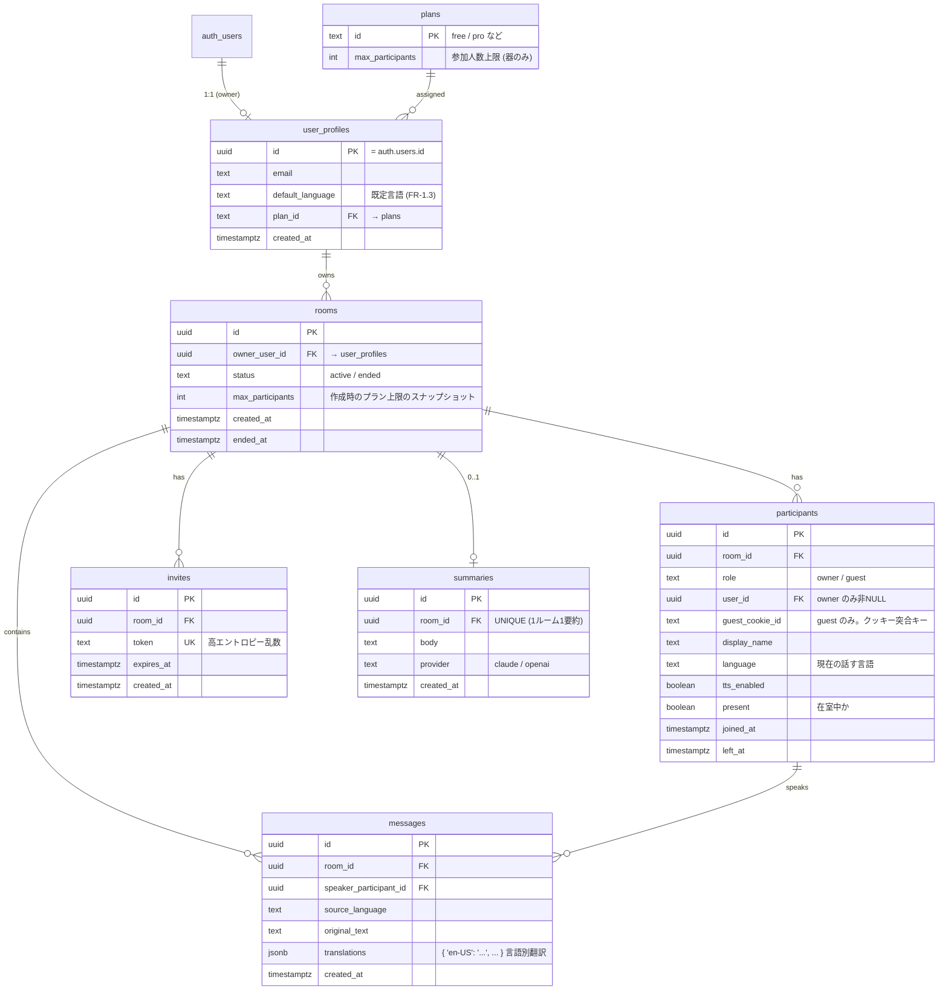

# DB設計

## 関連ドキュメント

- [設計概要 (overview.md)](./overview.md)
- [Supabase設計 (supabase-design.md)](./supabase-design.md)（RLS・Auth・service_role）
- [サーバー設計 (server-design.md)](./server-design.md)（履歴書き込み・配信ルーティング）
- [アプリ全体アーキテクチャ (app-architecture.md)](./app-architecture.md)
- [AIアシスタント設計 (ai-assistant-design.md)](./ai-assistant-design.md)（Summary 利用）
- 要件定義: [docs/requirements.md](../requirements.md)（§8 データモデル / FR-9 履歴 / FR-11 要約 / FR-13 プラン）

---

## 方針

- **Supabase（PostgreSQL）** に永続化。スキーマ・マイグレーションは Supabase CLI（`supabase/migrations/`）で管理する。
- **MVP は1対1、設計は1:N拡張可能**（要件§11⑧）。`Participant` と `Message` を分離し、参加者は可変数、翻訳は言語別 JSONB で持つことで N人・多言語へ素直に拡張できる。
- **音声は永続保存しない**（NFR-1.4）。永続化対象はテキスト（原文・翻訳）と要約のみ。
- オーナーは `auth.users`（Supabase Auth）と対応。ゲストは `auth.users` を持たず `Participant` としてのみ存在（署名クッキーで識別）。
- 型・命名は PostgreSQL 標準（snake_case、`uuid` 主キー、`timestamptz`）。

---

## ER図

---

## テーブル定義

### plans（プラン・器のみ）

プランごとの参加人数上限を保持する「器」。課金処理は実装しない（FR-13）。

| 列 | 型 | 制約 | 説明 |
|---|---|---|---|
| `id` | `text` | PK | `free` / `pro` 等 |
| `max_participants` | `int` | NOT NULL | ルーム参加可能人数上限。今回は実質無制限（例: free=2, pro=大きい値） |
| `created_at` | `timestamptz` | default now() | |

初期データ: `free`（`max_participants=2`）を投入。MVP は全ユーザー free、上限は実質無制限として扱う（FR-13.2）。

### user_profiles（オーナー）

Supabase Auth の `auth.users` を1:1で拡張する。`id` は `auth.users.id` と同一。

| 列 | 型 | 制約 | 説明 |
|---|---|---|---|
| `id` | `uuid` | PK, FK→`auth.users.id` | Supabase Auth のユーザーID |
| `email` | `text` | | 表示・照合用（Auth 側が正） |
| `default_language` | `text` | NOT NULL default `'ja-JP'` | 既定の使用言語（FR-1.3） |
| `plan_id` | `text` | FK→`plans.id`, NOT NULL default `'free'` | 所属プラン |
| `created_at` | `timestamptz` | default now() | |

- サインアップ時に Auth のトリガー（または Route Handler）で自動作成する（[supabase-design.md](./supabase-design.md#auth-とプロファイル) 参照）。

### rooms（トークルーム）

| 列 | 型 | 制約 | 説明 |
|---|---|---|---|
| `id` | `uuid` | PK default `gen_random_uuid()` | |
| `owner_user_id` | `uuid` | FK→`user_profiles.id`, NOT NULL | 所有者 |
| `status` | `text` | NOT NULL default `'active'` | `active` / `ended` |
| `max_participants` | `int` | NOT NULL | 作成時のプラン上限のスナップショット |
| `created_at` | `timestamptz` | default now() | |
| `ended_at` | `timestamptz` | NULL可 | 終了時刻（FR-12） |

- `status` は WSサーバーが終了時に `ended` へ更新（service_role）。

### participants（参加者）

owner/guest の両方を1テーブルで扱う。1:N のため room に対し複数行。

| 列 | 型 | 制約 | 説明 |
|---|---|---|---|
| `id` | `uuid` | PK default `gen_random_uuid()` | **ゲストクッキー JWT の `participantId`**（FR-3.2 再接続復帰の安定ID） |
| `room_id` | `uuid` | FK→`rooms.id`, NOT NULL | |
| `role` | `text` | NOT NULL | `owner` / `guest` |
| `user_id` | `uuid` | FK→`user_profiles.id`, NULL可 | owner のみ非NULL |
| `guest_cookie_id` | `text` | NULL可 | guest のみ。クッキー再突合の補助キー |
| `display_name` | `text` | NULL可 | 表示名（未設定可、FR-5.1） |
| `language` | `text` | NOT NULL | 現在の話す言語（FR-4） |
| `tts_enabled` | `boolean` | NOT NULL default true | 聞き手として TTS を受けるか |
| `present` | `boolean` | NOT NULL default false | 在室中か（WSが更新） |
| `joined_at` | `timestamptz` | default now() | |
| `left_at` | `timestamptz` | NULL可 | |

- `id` を安定 participantId とし、ゲストクッキー（jose JWT）の payload に載せる（[security-design.md](./security-design.md#ゲストクッキー) 参照）。再接続・再開時はこの id で同一参加者を復帰する。
- 制約: `role='owner'` は `user_id` 非NULL、`role='guest'` は `guest_cookie_id` 非NULL（CHECK 制約または DB トリガーで担保）。
- 1:N 拡張時も本テーブルは無変更（行が増えるのみ）。

### messages（発話）

確定発話ごとに1行。原文と**言語別翻訳を JSONB**で保持し、多言語・N人に対応する。

| 列 | 型 | 制約 | 説明 |
|---|---|---|---|
| `id` | `uuid` | PK default `gen_random_uuid()` | WSの `messageId` と一致 |
| `room_id` | `uuid` | FK→`rooms.id`, NOT NULL | |
| `speaker_participant_id` | `uuid` | FK→`participants.id`, NOT NULL | 話者 |
| `source_language` | `text` | NOT NULL | 原文言語 |
| `original_text` | `text` | NOT NULL | 原文 |
| `translations` | `jsonb` | NOT NULL default `'{}'` | `{ "en-US": "...", "ja-JP": "..." }` 送信先言語別 |
| `created_at` | `timestamptz` | default now() | 発話時刻 |

- 翻訳は「その発話で必要になった送信先言語」のみ格納（MVP は聞き手1言語＝1エントリ）。後から別言語の聞き手が履歴を見る要件は無いため、発生した翻訳のみ保存する（YAGNI）。
- 音声は保存しない（NFR-1.4）。
- 履歴閲覧（FR-9.2）はオーナーが `original_text` と `translations` を用いて自分の言語でタイムライン再構成する（[frontend-design.md](./frontend-design.md#履歴画面history) 参照）。

### summaries（要約）

1ルーム1要約（`room_id` UNIQUE）。終了時に生成（FR-11）。

| 列 | 型 | 制約 | 説明 |
|---|---|---|---|
| `id` | `uuid` | PK default `gen_random_uuid()` | |
| `room_id` | `uuid` | FK→`rooms.id`, UNIQUE, NOT NULL | |
| `body` | `text` | NOT NULL | 要約本文 |
| `provider` | `text` | NULL可 | `claude` / `openai`（生成元、[ai-assistant-design.md](./ai-assistant-design.md) 参照） |
| `created_at` | `timestamptz` | default now() | |

- 永続閲覧はオーナーのみ（FR-11.2）。ゲストへは終了時に WS の `summary` でその場表示のみ（FR-11.3、永続手段なし）。

### invites（招待・QR）

招待URLのトークン。`token` はルームID非依存の高エントロピー乱数（`crypto.randomBytes(24).toString('base64url')` 等）。

| 列 | 型 | 制約 | 説明 |
|---|---|---|---|
| `id` | `uuid` | PK default `gen_random_uuid()` | |
| `room_id` | `uuid` | FK→`rooms.id`, NOT NULL | |
| `token` | `text` | UNIQUE, NOT NULL | 招待トークン（QRにエンコード） |
| `expires_at` | `timestamptz` | NOT NULL | 有効期限（例: 作成から24〜48時間） |
| `created_at` | `timestamptz` | default now() | |

- QR は `https://{host}/join/{token}` を丸ごとエンコード（[app-architecture.md](./app-architecture.md#next-js-ページ構成とルーティング) 参照）。
- `/join/[token]` の Server Component がトークンを照合（期限切れ/無効はエラー画面）。参加確定時に `participants` 行を作成しゲストクッキーを発行する（[supabase-design.md](./supabase-design.md#ゲストのクッキー識別との連携) 参照）。
- 再開（FR-12.3）: オーナーが再度招待すると新しい invite を発行。ゲストクッキーが残っていれば既存 participant として復帰（`participants.id` で突合）。

---

## インデックス戦略

| テーブル | インデックス | 目的 |
|---|---|---|
| `rooms` | `(owner_user_id, created_at desc)` | オーナーのルーム一覧・履歴一覧（FR-9.2） |
| `participants` | `(room_id)` | ルームの参加者取得 |
| `participants` | `(room_id, guest_cookie_id)` | ゲスト再突合（FR-12.3） |
| `messages` | `(room_id, created_at)` | タイムライン取得・ページング（FR-9） |
| `invites` | `unique(token)` | トークン照合（主経路） |
| `summaries` | `unique(room_id)` | 1ルーム1要約 |

- `messages` の主アクセスは「ルーム内を時系列で取得」なので複合インデックスを主軸にする。
- 会話中は WSサーバーがインメモリ状態を持ち DB を読まない（[server-design.md](./server-design.md#状態モデルインメモリ) 参照）ため、読み取りインデックスは主に履歴閲覧向け。

---

## データ削除・ライフサイクル

- 音声は保存しない。テキスト・要約は保持（オーナーの振り返り用、FR-9）。
- 招待トークンは期限切れ後も行は残す（監査簡素化）。参加検証時に `expires_at` を判定。
- ユーザー削除時の関連行（rooms/participants/messages/summaries）は `on delete cascade` を基本とする（Supabase Auth のユーザー削除に追随）。MVP ではユーザー削除UIは未実装。

---

## フェーズ対応

| フェーズ | 対象テーブル |
|---|---|
| Phase 1 | `rooms`（簡易）・`participants`。認証最小のため owner/guest 区別は簡素でよい |
| Phase 2 | `user_profiles`・`plans`・`invites`、`participants` の owner/guest・cookie 突合、RLS 本格化 |
| Phase 3 | `messages`・`summaries` の書き込みと履歴閲覧 |
